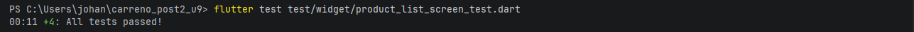
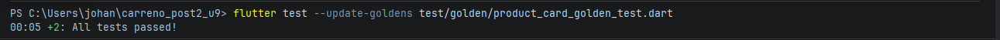
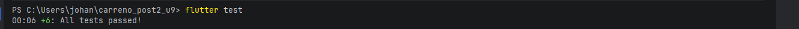
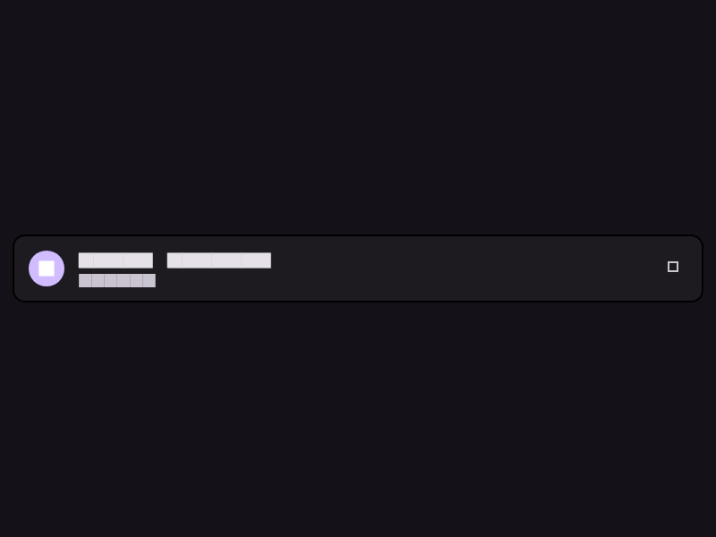

# Carreño Post2 U9 — Widget Tests y Golden Tests

**Curso:** Aplicaciones Móviles — Unidad 9: Testing y Aseguramiento de Calidad  
**Estudiante:** Johan Carreño  
**Universidad:** Universidad de Santander (UDES)  
**Año:** 2026

---

## Descripción

Este proyecto implementa widget tests y golden tests para una pantalla Flutter
con arquitectura BLoC. Se usa `mocktail` para aislar dependencias externas y
`bloc_test` para simular estados sin necesidad de red.

---

## Estructura del proyecto
lib/
bloc/product_bloc.dart          ← BLoC con estados Loading/Success/Error
model/product.dart              ← Data class Product
repository/product_repo.dart    ← Interfaz e implementación del repositorio
screen/product_list_screen.dart ← Widget bajo prueba
screen/product_card.dart        ← Tarjeta de producto (usada en golden tests)
main.dart
test/
widget/
product_list_screen_test.dart ← 4 widget tests con MockBloc
golden/
product_card_golden_test.dart ← 2 golden tests (tema claro y oscuro)
goldens/
product_card_light.png        ← Imagen de referencia (tema claro)
product_card_dark.png         ← Imagen de referencia (tema oscuro)

---

## Tests implementados

### Widget Tests

| Test | Propósito |
|------|-----------|
| `shows CircularProgressIndicator when Loading` | Verifica que el indicador de carga aparece en estado `ProductLoading` |
| `shows product list when Success` | Verifica que la lista y datos del producto se muestran en estado `ProductSuccess` |
| `shows error message when Error` | Verifica que el mensaje de error aparece en estado `ProductError` |
| `retry button dispatches LoadProducts event` | Verifica que al tocar retry se despacha el evento `LoadProducts` al BLoC |

### Golden Tests

| Test | Propósito |
|------|-----------|
| `ProductCard light theme matches golden` | Captura y compara el renderizado del `ProductCard` en tema claro |
| `ProductCard dark theme matches golden` | Captura y compara el renderizado del `ProductCard` en tema oscuro |

---

## Cómo ejecutar los tests

### Ejecutar toda la suite
```bash
flutter test
```

### Ejecutar solo widget tests
```bash
flutter test test/widget/product_list_screen_test.dart
```

### Ejecutar solo golden tests
```bash
flutter test test/golden/product_card_golden_test.dart
```

### Regenerar golden files cuando el cambio visual es intencional
```bash
flutter test --update-goldens test/golden/product_card_golden_test.dart
```

---

## Resultados de los tests

### Widget Tests


### Golden Tests


### Todos los tests


---

## Golden Files de referencia

### Tema claro


### Tema oscuro


---

## Dependencias

| Paquete | Versión | Uso |
|---------|---------|-----|
| `flutter_bloc` | ^8.1.4 | Gestión de estado BLoC |
| `mocktail` | ^1.0.3 | Mocking del BLoC en tests |
| `bloc_test` | ^9.1.7 | MockBloc y helpers de test |

---